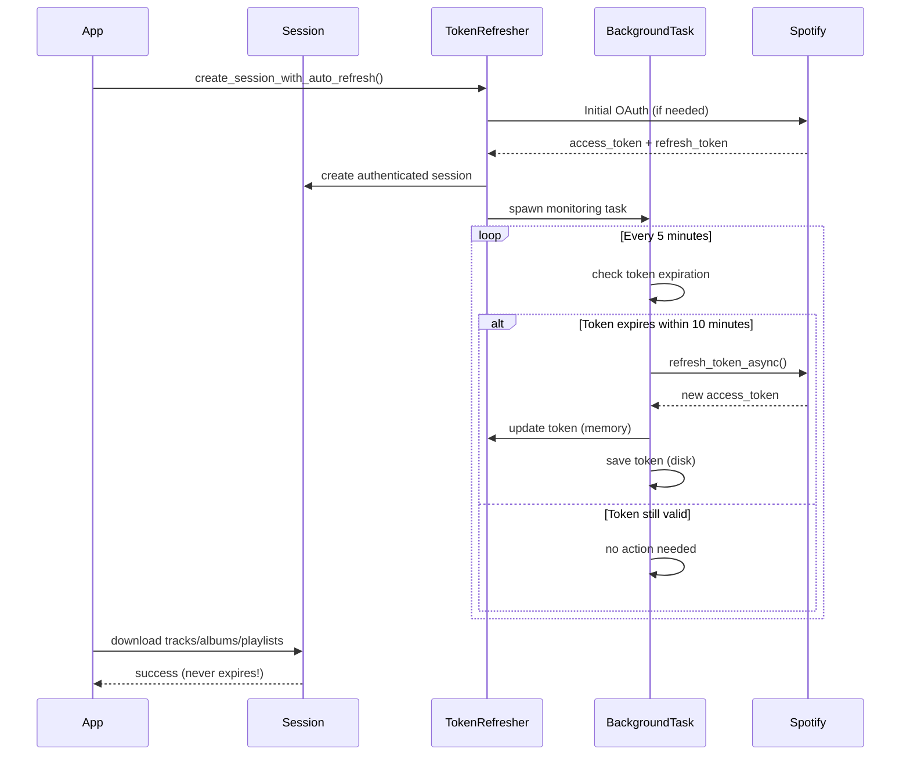

# Token Refresh Architecture

This document describes the automatic token refresh system that keeps your Spotify session authenticated indefinitely.

## Overview

The token refresh system uses a background task to proactively monitor and refresh OAuth tokens before they expire,
eliminating the need for repeated browser-based authentication during long-running operations.

## Architecture Diagram

```
┌─────────────────────────────────────────┐
│  Your App (downloading albums/playlists) │
└─────────────────────────────────────────┘
                  │
                  │ uses
                  ▼
        ┌─────────────────┐
        │   Session       │
        └─────────────────┘
                  │
                  │ authenticated by
                  ▼
        ┌─────────────────────────┐
        │   TokenRefresher        │◄──┐
        │  - current_token        │   │
        │  - credentials_path    │   │
        └─────────────────────────┘   │
                  │                    │
                  │ spawns             │ refreshes
                  ▼                    │
        ┌──────────────────────────┐  │
        │  Background Task         │  │
        │  (checks every 5 min)    │──┘
        │  - Check expiration      │
        │  - Refresh if needed     │
        │  - Update disk + memory  │
        └──────────────────────────┘
```

## Component Flow



## Token Lifecycle Timeline

```
Time    Event                                       Action
─────────────────────────────────────────────────────────────────────────
00:00   App starts                                 Token valid for 60 min
        └─ Initial OAuth flow completes
        └─ Background task spawned

05:00   Background check #1                        No action
        └─ Token expires in 55 min (safe)

10:00   Background check #2                        No action
        └─ Token expires in 50 min (safe)

...

50:00   Background check #10                       **REFRESH TRIGGERED**
        └─ Token expires in 10 min (threshold!)    ├─ Call refresh_token_async()
                                                    ├─ Get new token (valid 60 min)
                                                    ├─ Update memory
                                                    └─ Save to disk

55:00   Background check #11                       No action
        └─ Token expires in 55 min (safe)

...continues indefinitely...
```

## Data Structures

### TokenData (Stored on Disk)

```rust
{
  "access_token": "BQC8xK2...",      // Used for API authentication
  "refresh_token": "AQD1mP...",      // Used to get new access tokens
  "expires_at": 1738454321           // Unix timestamp (seconds)
}
```

Stored at: `.spotify_access_token` (JSON format)

### TokenRefresher (In-Memory)

```rust
pub struct TokenRefresher {
    credentials_path: String,                     // Path to credentials file
    current_token: Arc<RwLock<Option<TokenData>>>, // Thread-safe current token
}
```

## Configuration

| Setting           | Value       | Description                                   |
|-------------------|-------------|-----------------------------------------------|
| Check interval    | 5 minutes   | How often background task checks expiration   |
| Refresh threshold | 10 minutes  | Refresh when token expires within this window |
| Token validity    | ~60 minutes | Spotify's default access token lifetime       |
| Expiration buffer | 5 minutes   | Safety margin for `is_token_expired()` checks |

## Usage

### Recommended (with auto-refresh)

```rust
let (session, _refresher, _refresh_handle) = 
    create_session_with_auto_refresh(".spotify_access_token").await?;

// Use session for hours/days without worrying about expiration
cache_album(&session, album_uri, music_dir).await?;
```

### Manual (not recommended for long operations)

```rust
let credentials = get_credentials(".spotify_access_token").await?;
let session = create_authenticated_session(credentials).await?;

// Session may expire during long operations!
```

## Error Handling

### Automatic Recovery

- **Token refresh fails**: Logged as warning, retried on next cycle
- **Invalid refresh token**: Falls back to full OAuth flow (browser)
- **Network timeout**: Logged, retried on next cycle
- **Disk write fails**: Token still updated in-memory, logged as warning

### Manual Intervention Required

- **Browser OAuth fails**: User must provide valid credentials
- **Bad credentials**: Token file deleted, triggers re-authentication

## Benefits

✅ **Zero-maintenance**: Once started, runs indefinitely  
✅ **Proactive**: Refreshes before expiration, not after failure  
✅ **Resilient**: Handles network issues gracefully  
✅ **Efficient**: Only refreshes when needed (not every API call)  
✅ **Persistent**: Saves refreshed tokens for next run  
✅ **Observable**: Logs all refresh attempts for debugging

## Logging

Enable detailed logs with:

```bash
RUST_LOG=debug cargo run -- <spotify_uri>
```

Look for:

- `Background token refresh task started` - Task initialization
- `Token expiring soon, refreshing in background...` - Refresh triggered
- `Background token refresh successful` - Refresh completed
- `Background token refresh failed: <error>` - Refresh failed (will retry)

## Testing

Run auth module tests:

```bash
cargo test --lib auth
```

Tests cover:

- Token expiration detection
- Token save/load roundtrip
- TokenRefresher initialization
- OAuth configuration validation
